# Summary

## [Kakaotalk analysis]

```
df = pd.read_csv('data/katalk_klayton_full.csv')

# message 정재
df['Message'] = df['Message'].apply(preprocessing)
df = df[df['Message'] != '']

# plot
show_plot(df['Message'])

# word cloud
show_word_cloud(' '.join(df['Message']))

# okt
show_word_cloud(get_okt_text(' '.join(df['Message'])))

# 빈도 분석
show_user_freq('Tony Stark', df)

# 연도 기준 메세지 분석
df['Date'] = pd.to_datetime(df['Date'])
df = df.set_index('Date')
year = "2020"
show_plot(df[year + '-01-01': year + '-12-31']['Message'])
```

### 채팅방과 시세는 관련이 있을까?

### 전체 빈도 분석
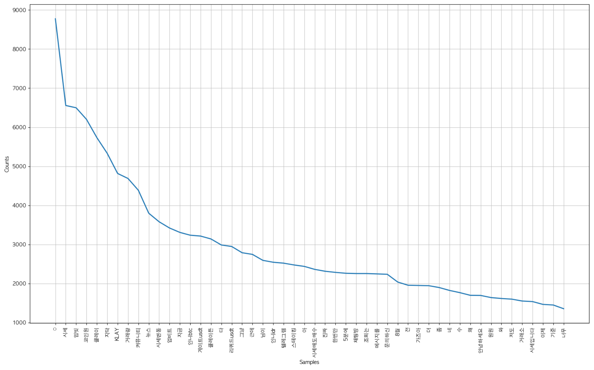

1. 시세 
2. 업빗 
3. 코인원 
4. 클레이튼

시세에 관심이 많고 상장에 관심이 많음.

### 방장 빈도 분석
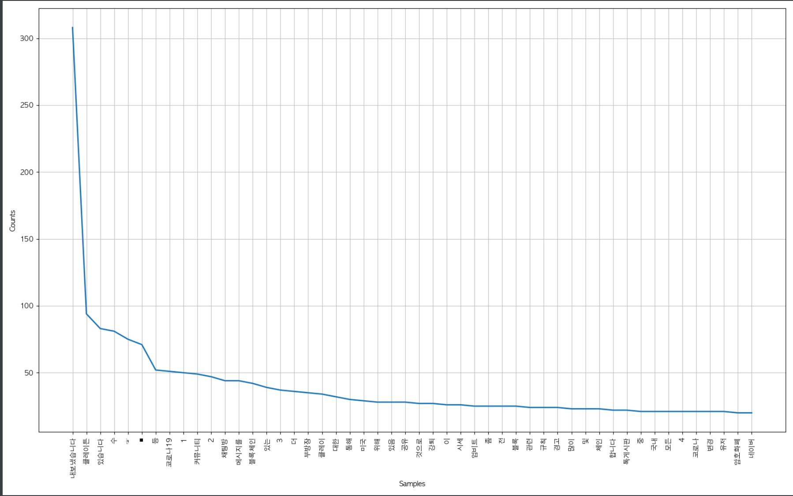

방장이라 강퇴를 많이함. 별 내용없음 

### 연도별 빈도 분석

####2019
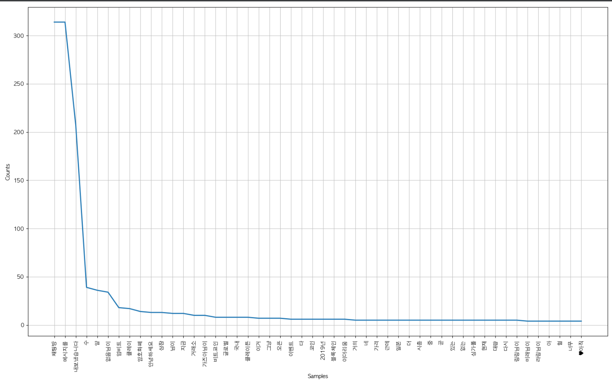

####2020
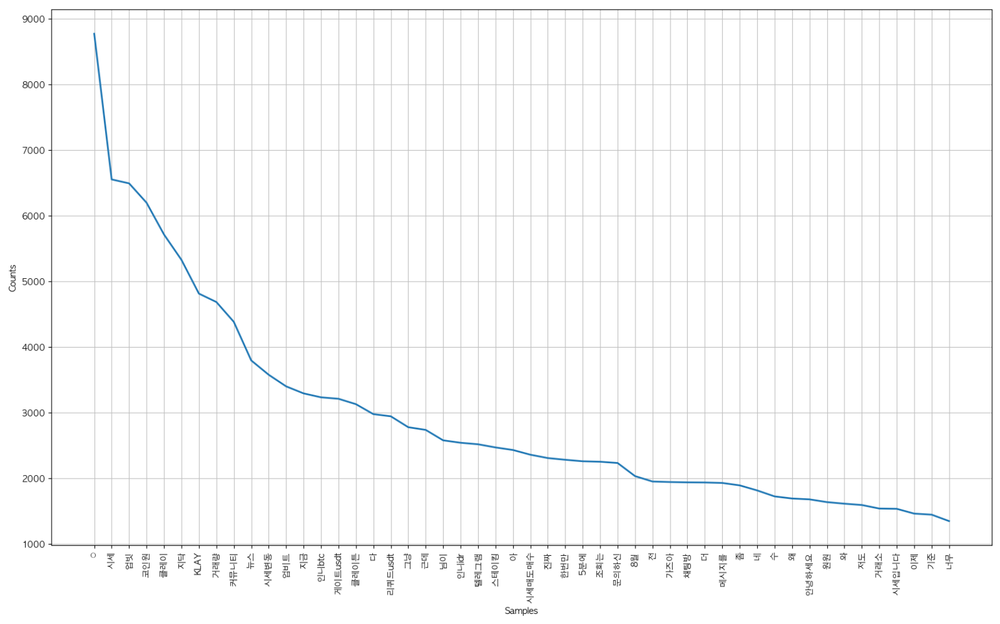

업빗 : 사람들이 업비트에 상장되기를 열망하고 있다 + 업비트 인도네시아에서 살 수 있음.
지닥 : 지닥 도둑 상장 이슈에 관심이 많았음 (누가 의도적으로 한 느낌도 있음)
클레이 : 클레이 방을 나타냄
코인원 : 코인원 상장 이슈
2020년 채팅수가 많이 늘어난 걸로 보아 2019년에는 유명하지 않았음.

2019년에는 시세라는 단어가 없었는데 2020년에는 시세가 많아짐. 아래 시세봇이 생겨서 그렇다.

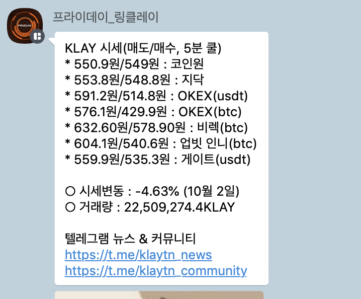

### 재미로보는 워드 클라우드 

형태소 분석 사용 전
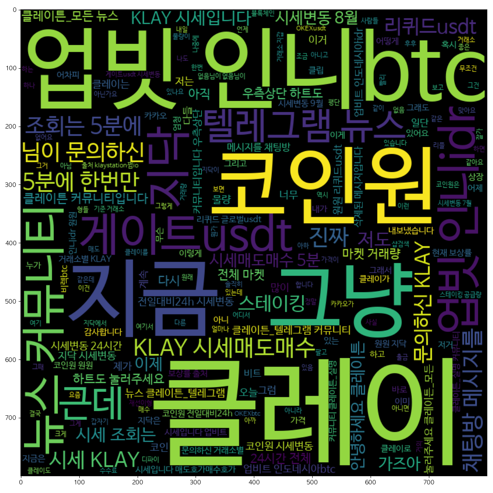

형태소 분석 사용 후
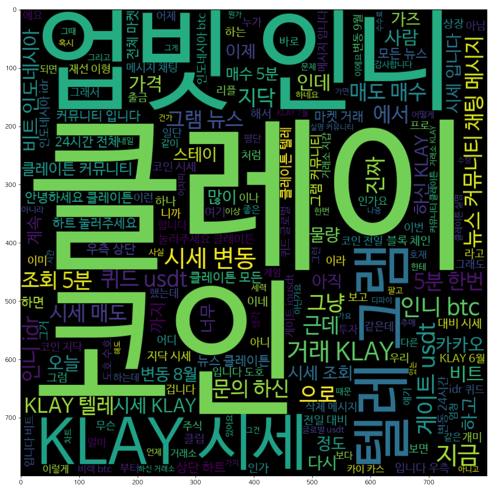

큰 글씨에서 [지금, 그냥, 근데] 라는 단어가 사라지는것으로 보임. 의미없는 것들이 많이 사라진건가..?

채팅 정보에 Date도 존재하기 때문에 채팅방 시점과 클레이튼 차트를 비교해서 영향도를 구경해봐도 재밌을듯..하지만 결론은 차트가 먼저 일듯.. 


## [좋은회사 나쁜회사 classification]

### origin

기존origin heatmap 

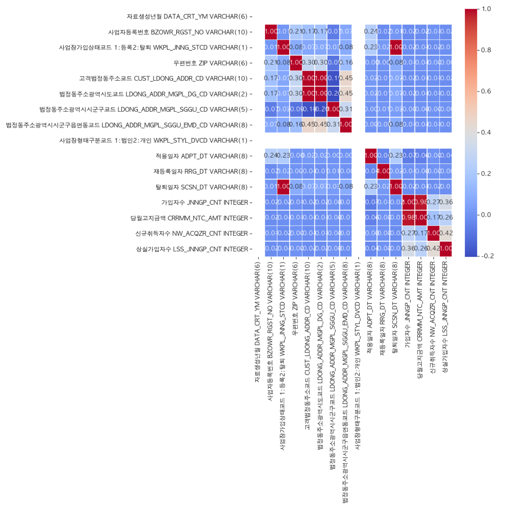
 

### 수정한 plot

데이터 필요한 것만 추린 heatmap

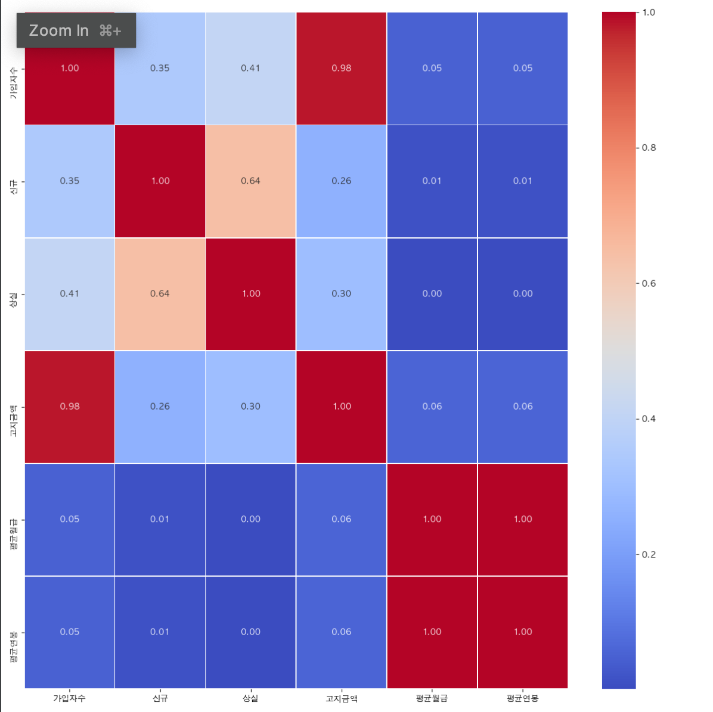

### 파생변수 추가한 plot

1. 가입자 대비 상실을 추가
2. 기준을 여러 사이트 리뷰 보고 데이터를 손수 구해봄 (bad_corp.csv, good_corp.csv) (힘듬)
3. status 좋은 1, 나쁜 0으로 변경 
4. 이상한 데이터 걸러내는 것도 힘듬

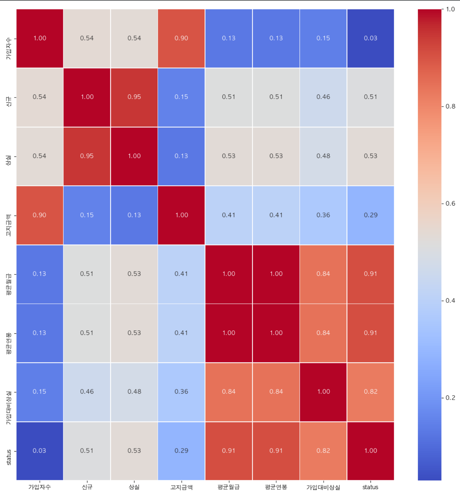

##### 생각중
연봉, 가입대비 상실이 높은 영향을 미침 
지역을 뺏는데 중요할 것 같다.. 선호도 때문에 + 좋은 회사들이 좋은 위치에 있음

좋은 회사임에도 불구하고 나쁜위치에 있는 곳은 어떻게..?
좋은 회사임에도 낮은 연봉을 주는 회사는 어떻게..?
사용자 리뷰 같은 것을 수집해서 크롤링해서 넣야아하나..? 리뷰글에 대한 감정 로직이 필요한가? 


graphviz

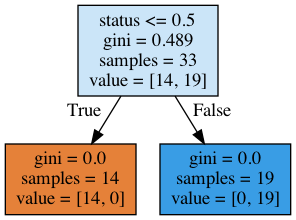

공부필요

predict하고 잘 맞았는지 실제 랜덤으로 뽑아서 검증하는 것을 해야하나?


## Study "Ensemble" 

여러가지 모델이용해서 최적의 답을 찾아봐야.

- Voting
- Bagging
- Boosting
- Stacking

- Voting - Regression
- Voting - Classification
- Bagging
- RandomForest
- Boosting
- GradientBoost
- XGBoost
- Stacking
- Weighted Blending


